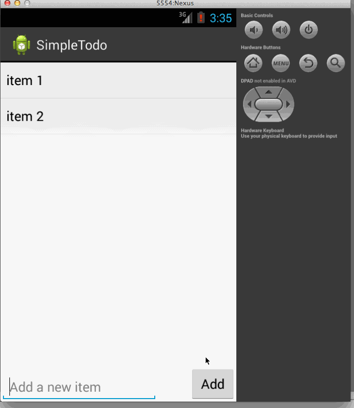

Android_SimpleTodo App
==================
It's a simple todo list that allows users to add new tasks to a task list. 
Time spent: 4 hours spent in total (2 hours spent on installing/configuring the dev environment, 2 hours on getting the app done)

Features:
<li> Add new tasks to your todo list. </li>
<li> Remove a task by tap-holding the task item.</li>

</img>

